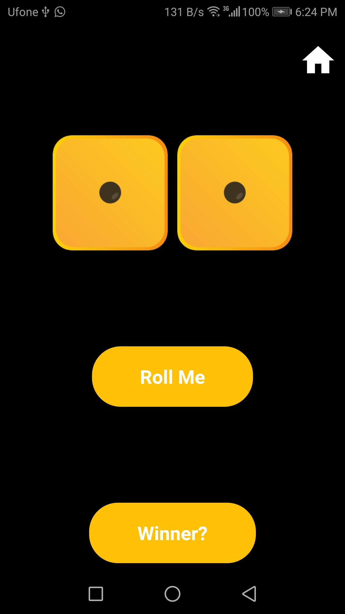
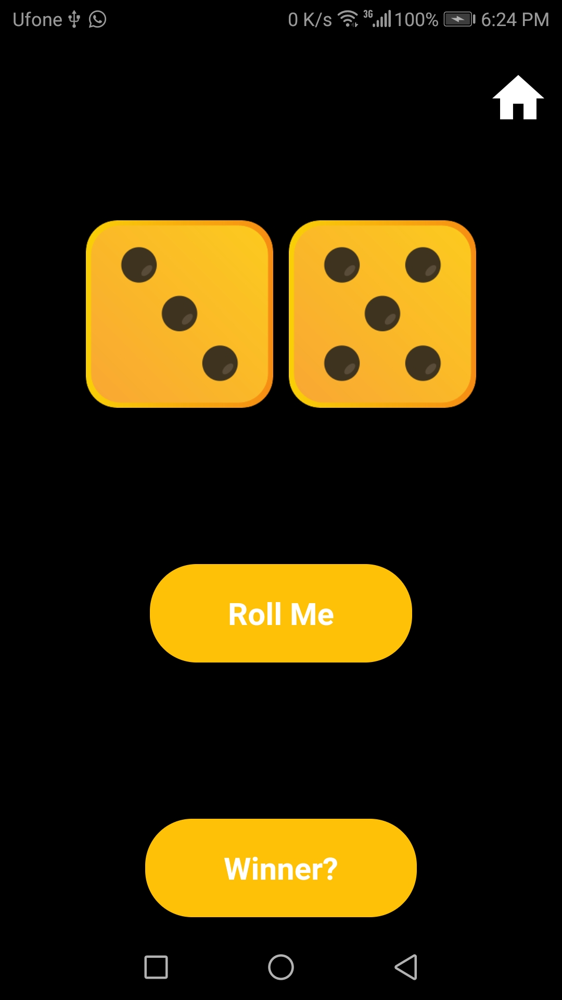

# MDiceGuessingGame - SP17-BCS-053 UMAIR
> Mobile App Development 2nd Sessional

## Features:

* Multiple Screens
* Start With Splash Screen.
* Two levels
* Guessing game and dice total Win.
* Automaticaly move to Result After Complete.
* Result Page (Show Score)
* Drawer on Homepage.
* HomeButton on All page.

## ScreenShots:
<kbd></kbd>
<kbd></kbd>
<kbd></kbd>
<kbd></kbd>
<kbd></kbd>
<kbd></kbd>
<kbd></kbd>
<kbd></kbd>

our Playstore Account: 
[`LearnHubStudio`](https://play.google.com/store/apps/dev?id=7836337206155769013) 

 For Upcoming Apps, Follow me 
[`umairnawaz333`](https://github.com/umairnawaz333) 
